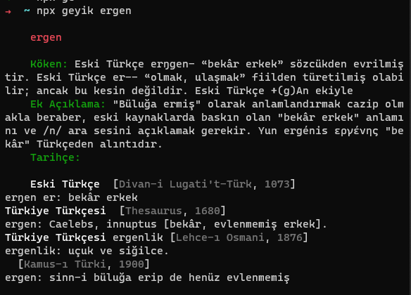

# Geyik

Geyik, sözcüklerin kökenine bakmanızı sağlayan küçük bir cli uygulamasıdır.

## Kurulum

```
git clone https://github.com/fdemir/geyik.git
cd geyik
yarn
npm i -g .
```

## Kullanım

```
geyik <sozcuk>
```



### Kaynak

https://www.nisanyansozluk.com
